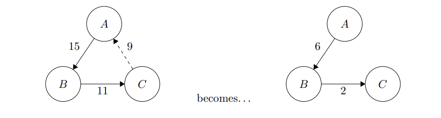

# Assignment 06: Debt Tracker DApp

In This assignment students will use `Anchor, Solana's Sealevel runtime framework` framework to implement a smart contract or `Program` functionality on Solana\
Starting project will be in `./src` directory. This Project is similar to stanford [cs251's one](https://cs251.stanford.edu/hw/proj3.pdf) but re-adjusted for Solana.

**References:**

* [Deploying Programs | Solana Docs](https://docs.solana.com/cli/deploy-a-program)
* [Anchor Book](https://book.anchor-lang.com/)
* \[Ancho Framework Website]\(Solana's Sealevel runtime framework)

**Surface Level Description:**\
The DApp we are going to create will be a sort of dept tracker app like [Splitwise](https://www.splitwise.com/), it will help people to keep track of who ows whom and how much. And if at some point the debts come out to be distributed in a circular way we can just remove the minimal amount of dept from everyone, so that things become simpler to calculate (instead of everyone just paying their initial amount): 

An assignment will be containing two parts: **the program** and the **client library**.

**Client Functionality:**\\

* `getUsers()` - this method will return all the users that are debtors or creditors and their additional information
* `getTotalOwed(user)` - returns total debted amount of a specific userr
* `getLastActive(user)` - returns the last user who changed the state on the blockchain
* `add_IOU(creditor, amount)` - submits an IOU(short for _I owe you_) to the program, with the passed creditor and amount. this method will encapsulate an instruction to be sent on a blockchain. the other ones are fetches.

**Program Instructions**\\

* **add\_IOU** - informs the blockchain that instruction initializer owes some amount to the address he specified.
* ... there might be one or two more instructions, the contract will be needed to be converted from ethereum and we'll see if a lot of things needed to be changed

**Resolving Loops of Debt:**\
You can read this part from the document linked above.

in spite of the fact that the assignment is designed on ethereum there might be some changed to be done to make it work for solana as well. Especially the Loop resolving part. it really matters how we are going to store all the debtors because storage works different than on ethereum and programs can't really querry all the accounts they own all that easy.
